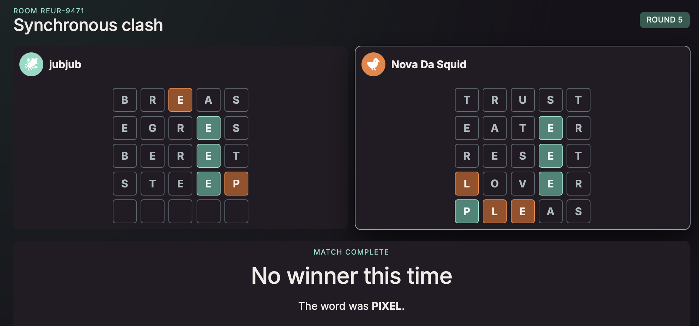
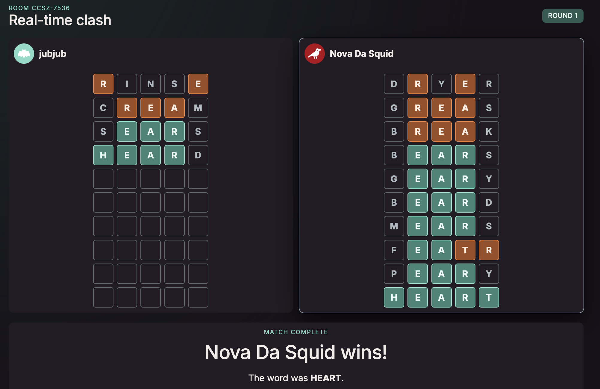

# Wordle Clash

**Multiplayer Wordle, built for chaos.** Create a room, invite your friends, and
race to find the word before they do.

[Play Wordle Clash](https://wordleclash.com)

## Two ways to clash

- **Synchronous:** Everyone locks in one guess per round. Guesses stay secret
  until every player submits or the timer expires, then reveal together.
- **Real-time:** No turns and no waiting. Submit as quickly as you can—the first
  player to solve the word wins.

Any five-letter string is a valid guess. There is no dictionary standing between
you and a deeply questionable strategy.

## Screenshots

| Synchronous | Real-time |
|---|---|
|  |  |

## Built for friends

- Two to eight players in a room
- No account or login required
- Shareable room codes + invite links
- Reconnect-safe matches backed by Cloudflare Durable Objects
- Simultaneous reveals, live opponent boards
- Real-time game allows for rapid-fire brute force guessing

## Development

To run locally see [`LOCAL-DEV.md`](./LOCAL-DEV.md).

- [Gameplay rules](./docs/game-rules.md)
- [Architecture](./docs/architecture.md)
- [Stories and roadmap](./docs/stories/)
- [Deployment](./docs/deployment.md)
- [Repository conventions](./AGENTS.md)
