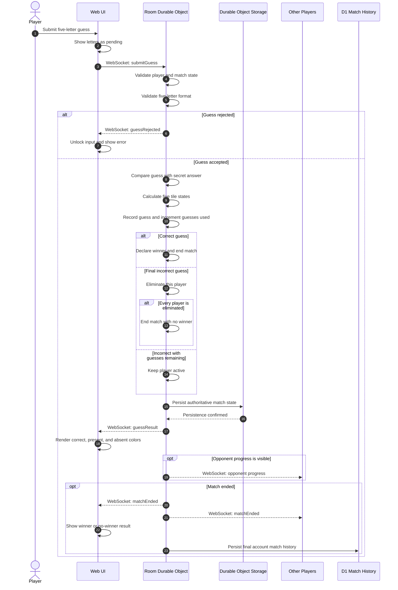

# Guess submission flow

The Room Durable Object validates, evaluates, and persists every accepted guess
before the UI receives authoritative tile feedback. D1 is not part of this hot
path; it receives account-owned match history after the match ends.

